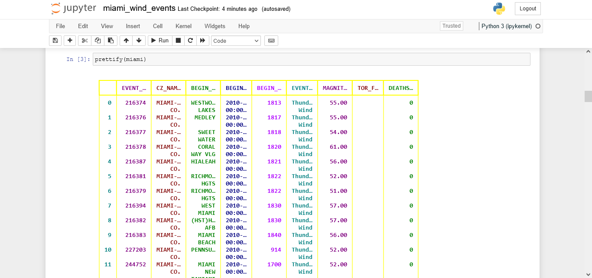
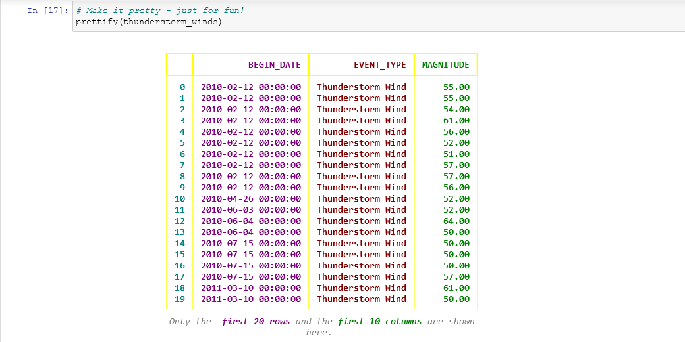

# Exploratory Data Analysis: Miami-Dade County StormWind Events

For this project, I downloaded a dataset from the National Centers for Environmental Information to analyze thunderstorm winds and tornadoes in Miami-Dade County in Florida from 2010-2020. The Storm Event Database allows users to search for storm events and download a focused dataset.

## Analysis Process

- Created a Python virtual environment
- Installed the following packages: `notebook`, `ipywidgets`, `pandas`, `numpy`, `statistics`, `matplotlib`, and `rich-dataframe`.
- Recorded the commands I used in a Python file
- Ran the analysis in a Jupyter Notebook, specifically to get the visualizations

## Summary of Findings

- The shape of the Miami-Dade County storm wind events dataset is (105, 39).
- From 2010 to 2020, there were a total of 93 Thunderstorm Wind events and 12 Tornado events.
- The year 2012 had the most wind storm events with 20 events, while 2018 had the least number of events at 2.
- Wind magnitudes for Thunderstorm Winds ranged from 36mph to 65mph. 
- The population variance for the wind magnitudes of Thunderstorm Winds in this dataset is 29.113654757775464
- The mode for thunderstorm wind magnitudes is 52mph.

## Prettify Tables

I used the `rich-dataframe` library to display colorful tables of the dataframes; however, the Jupyter Notebook does not save the output. Below are the screenshots. 

**Cropped screenshot of full dataset in a colorful dataframe**

**Screenshot of the dataset limited to Thunderstorm Winds and Magnitudes**
